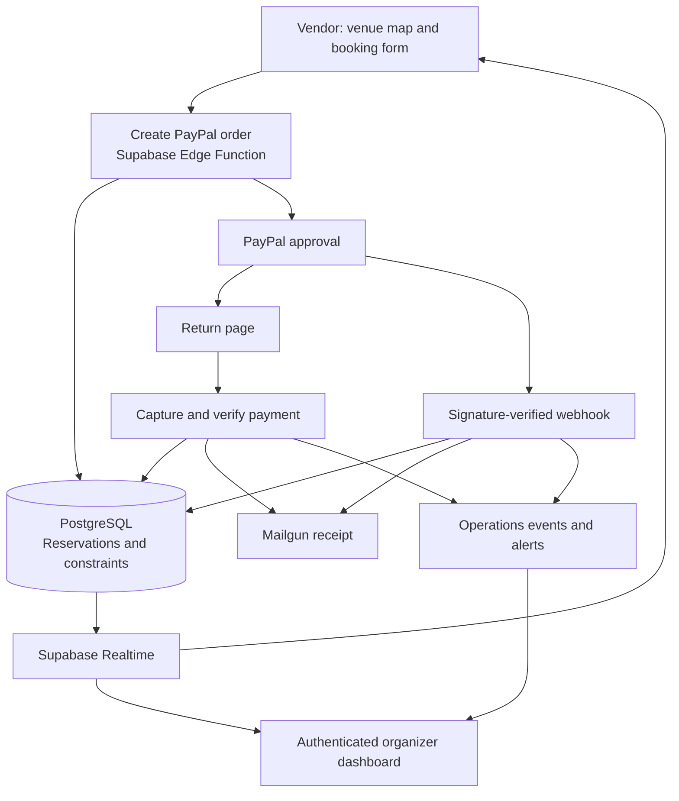

<div align="center">

# Tiregan 2026

### From a venue map to a confirmed vendor booking.

A deployed event-commerce project built for the Tri-City Iranian Cultural Society in Coquitlam, British Columbia.

**Interactive floor plan · Server-verified payments · Organizer operations**

[Event website](https://tcicsbooking.com) · [Architecture](#architecture) · [Explore the code](#explore-the-code) · [Local preview](#local-preview)

</div>

---

## The Project

Booking a festival booth involves more than collecting a payment. A vendor needs to choose a physical location, understand its price, reserve it while checking out, and receive confirmation. The organizer needs to see who booked, what happened to the payment, and what needs attention.

Tiregan brings those steps into one application: an interactive venue map for vendors and a companion operations dashboard for the organizer. It was deployed for **Tiregan 2026 at Lafarge Lake Park, Coquitlam**, as a VenueMap event-specific implementation.

Built and operated by **Bardia Malackzadeh**, with AI-assisted development and iterative production support.

> **Event archive:** The 2026 event has concluded. The live site's closed/sold inventory display includes administrative markers and must not be interpreted as a count of online purchases. Please do not submit test bookings or payments to the production site.

## Project Snapshot

| Scope | Implementation |
| :--- | :--- |
| Venue inventory | 89 public booth spaces across six categories |
| Buyer experience | Image-based floor plan, touch pan/zoom, booth details, booking form and checkout |
| Backend | Seven TypeScript Edge Functions and a shared payment/email module |
| Data | Booking records, operations events, audit history and health snapshots |
| Payments | PayPal order creation, capture and signature-verified webhooks |
| Support | English/Persian rule-based assistant with 46 intent entries |
| Operations | Search, CSV export, receipt retries and email alerts |

## What Vendors Can Do

- **Choose the actual location.** Positioned and rotated booth overlays connect the purchase to the venue layout.
- **See inventory updates.** Supabase Realtime events trigger refreshed availability reads.
- **Reserve during checkout.** Temporary holds distinguish checkout in progress from payment pending and sold states.
- **Buy a package.** A discounted two-booth offer uses one PayPal checkout with two inventory records.
- **Understand the outcome.** The return page asks the backend to verify payment and explains pending or review states.
- **Get help in English or Persian.** The assistant normalizes Persian digits and character variants, matches FAQ intents, and answers specific-booth questions using current page state.

The assistant uses deterministic rules and fuzzy keyword matching; it does not use an LLM.

## What Organizers Can Do

The administrator view combines a venue map with searchable booking records, buyer details, status controls and exports. Payment references and receipt state are visible alongside operational events. Authenticated administrators can run a health report or retry a receipt email.

Database audit triggers retain before/after records of booking changes. Edge Functions log payment and receipt events, and selected failures generate Mailgun alerts.

## Architecture



### The payment boundary

1. The browser submits a booth identifier and vendor details.
2. The server validates the booth and determines its price from the server-side catalog.
3. Reservation rows are inserted before the PayPal approval URL is returned.
4. The backend captures the order and checks the reservation association, amount and currency.
5. PayPal webhook signatures are verified before accepted payment events update booking state.
6. Receipt attempts and failures are recorded separately from payment confirmation.

The public buyer browser does not decide that a payment has completed. Administrators have a separate, privileged workflow for manually managing inventory.

### Database protection

The payment migration defines:

- A partial unique index permitting only one active reservation row per booth.
- Unique non-null PayPal order and capture identifiers.
- Row-level security with administrator access based on application-managed role metadata.
- Anonymous read access restricted to booth ID, status and expiry columns.

PayPal requests use reservation-derived request IDs for create/capture retries. These controls protect specific operations; they do not provide an end-to-end exactly-once guarantee across the payment provider, database and email service.

## Stack

| Layer | Technology |
| :--- | :--- |
| Frontend | Vanilla HTML, CSS and JavaScript |
| Server functions | TypeScript on Supabase's Deno Edge runtime |
| Database | Supabase PostgreSQL, SQL constraints and RLS |
| Authentication | Supabase Auth; administrator email/password login |
| Live updates | Supabase Realtime Postgres-change subscriptions |
| Payments | PayPal Orders/Capture REST APIs and webhooks |
| Email | Mailgun HTML/text receipts, alerts and outreach |
| Venue map | Static venue image with custom DOM overlays and pan/zoom |
| Hosting | Bluehost static frontend; Supabase backend |
| Utility tooling | Python standard-library CSV outreach CLI |

## Explore the Code

```text
.
├── index.html                    Event entry page
├── tiregan.html                  Buyer map, checkout form and help assistant
├── tiregan-success.html          Payment return and confirmation states
├── tiregan_admin.html            Organizer operations dashboard
├── privacy.html                  Event privacy information
├── sendmarketing.py              CSV outreach utility
├── businesses.example.csv        Synthetic example input
├── SECURITY_DEPLOYMENT.md         Historical deployment notes
└── supabase/
    ├── config.toml
    ├── migrations/               Payment constraints and operations schema
    └── functions/
        ├── _shared/tiregan-paypal.ts
        ├── create-paypal-order/
        ├── capture-paypal-order/
        ├── paypal-webhook/
        ├── expire-tiregan-pending/
        ├── tiregan-health-report/
        ├── tiregan-retry-receipt/
        └── send-test-receipt/
```

Suggested reading order: [server price catalog](supabase/functions/_shared/tiregan-paypal.ts), [database constraints](supabase/migrations/20260511_harden_tiregan_payments.sql), [order creation](supabase/functions/create-paypal-order/index.ts), [capture](supabase/functions/capture-paypal-order/index.ts), [webhook](supabase/functions/paypal-webhook/index.ts), then [operations schema](supabase/migrations/202605190001_tiregan_ops_observability.sql).

## Local Preview

No frontend build step is required. With Python 3 installed:

```sh
python3 -m http.server 8080 --bind 127.0.0.1
```

Open `http://localhost:8080/index.html` or `http://localhost:8080/tiregan.html`.

**The publishing copy uses placeholder backend configuration.** Production Supabase identifiers and client keys have been removed. Backend-dependent features will not work until you replace the client configuration in `tiregan.html`, `tiregan-success.html` and `tiregan_admin.html` with a separate development project's values, including the matching CSP host allowlists. The admin page contains more than one client initialization. Do not use the production backend for portfolio testing.

Venue imagery, fonts and the Supabase browser library are remotely hosted, so a fully offline preview is not provided.

### Backend setup boundary

This repository preserves an event deployment, not a turnkey generic booking service. The earliest migration assumes an existing `tiregan_booths` base table, and several migration files are history placeholders for the shared Supabase project. **The included migrations alone are not a complete clean-install schema.**

For a development deployment, reconstruct and verify the base schema in an isolated project, review the migrations and RLS, configure sandbox credentials, and then deploy the required functions. See [deployment notes](SECURITY_DEPLOYMENT.md) and [.env.example](.env.example) for configuration names. Do not link a fork to the production project or push migrations there.

Webhook configuration must include both capture-completed and capture-pending events supported by the handler. The historical deployment notes list completed as the minimum. Automatic hold cleanup scheduling and live hosting headers must be verified separately; neither is established by this source snapshot.

### Preview outreach safely

Python 3.10+ is required for the marketing utility. No third-party Python packages are needed.

```sh
python3 sendmarketing.py --csv businesses.example.csv --dry-run
python3 sendmarketing.py --test preview@example.com --dry-run
```

Actual sending requires `MAILGUN_API_KEY` in the process environment. Review sender/domain settings and use your own authorized recipient list. `.env.example` documents variables; the script does not automatically load `.env` files. Real lists, send logs and credentials are excluded from version control.

## Engineering Lessons and Current Limits

The interesting problems emerged at the boundaries: an expired reservation with an existing payment order, duplicate callbacks, a package spanning multiple booth rows, and distinguishing inventory closure from actual revenue.

This archive has known follow-up work:

- Reconcile order-bearing expired holds so UI availability and database state agree.
- Enforce monotonic payment transitions when callbacks arrive out of order.
- Update package inventory transactionally using a durable booking-group identifier.
- Coordinate receipt sending through a durable queue/outbox to handle concurrent callbacks.
- Separate manually closed inventory from revenue calculations.
- Add server-side checkout rate limiting, a complete bootstrap schema and automated regression tests.

Receipts are HTML/text emails. Refund automation, PDF receipt generation, a general venue editor and multi-event vendor accounts are not part of this Tiregan deployment.

## Security and Publication

This publishing copy excludes customer lists, send logs, local caches and Supabase CLI state. The marketing credential fallback has been removed; use environment configuration. Previously exposed credentials should be rotated independently of this repository cleanup.

Do not open public issues containing buyer information, payment identifiers or credentials. The code is presented as a portfolio project; organization branding, venue imagery and other third-party assets remain subject to their owners' rights. No open-source license is granted by this README.

---

<div align="center">

**Tiregan 2026 · Coquitlam, BC**  
A real event, a deployed product, and the engineering lessons that came with operating it.

</div>
